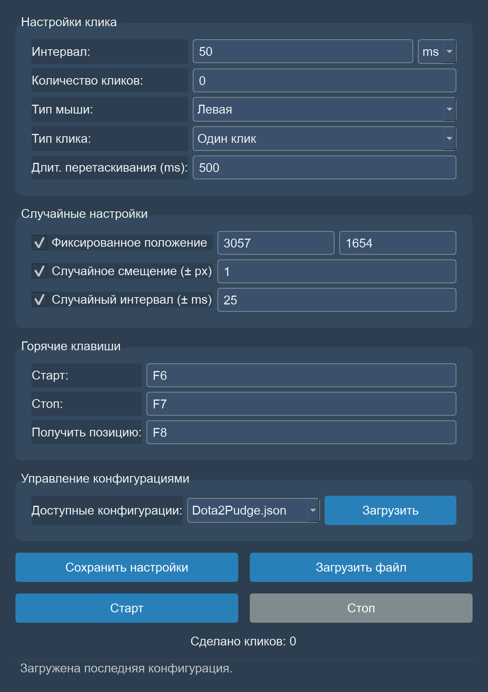
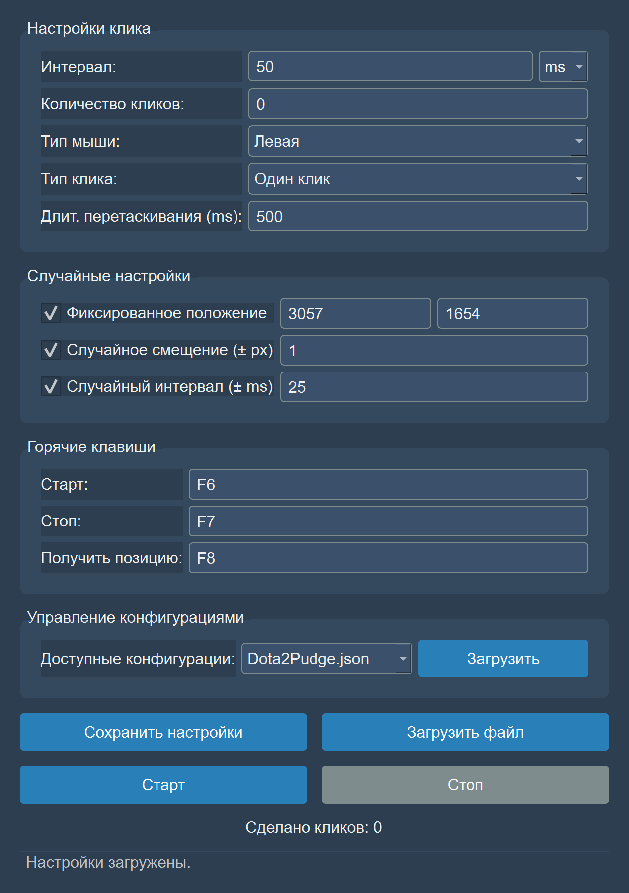

# Auto Clicker Pro

Продвинутый автокликер с графическим интерфейсом, созданный на Python с использованием библиотеки PyQt6. Приложение предоставляет широкий спектр настроек для автоматизации кликов мыши, включая интервалы, типы кликов, позиционирование и рандомизацию, а также поддерживает сохранение и загрузку профилей конфигурации.

## 🚀 Особенности (Features)

  * **Гибкая настройка интервала**: Установка задержки между кликами в миллисекундах или секундах.
  * **Ограничение количества кликов**: Возможность задать точное количество кликов или запустить бесконечный цикл.
  * **Выбор кнопок и типов клика**: Поддержка левой, правой и средней кнопок мыши, а также одиночных, двойных кликов и перетаскивания.
  * **Точное позиционирование**: Клики в текущей позиции курсора или в заданных координатах.
  * **Рандомизация**:
      * Случайное смещение позиции клика в указанном диапазоне пикселей.
      * Случайное изменение интервала между кликами.
  * **Глобальные горячие клавиши**: Управление запуском, остановкой и захватом координат без необходимости фокуса на окне приложения.
  * **Менеджер конфигураций**: Сохранение и загрузка настроек в формате `.json`, что позволяет быстро переключаться между разными задачами.
  * **Автозагрузка**: Приложение автоматически загружает последнюю использованную конфигурацию при запуске.
  * **Современный интерфейс**: Стилизованный темный интерфейс для комфортного использования.

-----

## 🖼 Как это выглядит

| Окно при запуске | С загруженным пресетом |
| --- | --- |
|  |  |

Скриншоты не сняты руками, а собираются из самой программы:

```bash
python scripts/capture_usage_screenshots.py
```

-----

## ⚙️ Установка (Installation)

Для работы приложения требуется **Python 3.x**.

1.  **Клонируйте репозиторий:**

    ```bash
    git clone https://github.com/IGORSVOLOHOVS/Autoclicker.git
    cd Autoclicker
    ```

2.  **Создайте и активируйте виртуальное окружение (рекомендуется):**

      * **Windows:**
        ```bash
        python -m venv venv
        venv\Scripts\activate
        ```
      * **macOS / Linux:**
        ```bash
        python3 -m venv venv
        source venv/bin/activate
        ```

3.  **Установите необходимые зависимости:**
    Создайте файл `requirements.txt` и добавьте в него следующие строки:

    ```
    PyQt6
    pyautogui
    keyboard
    ```

    Затем выполните команду:

    ```bash
    pip install -r requirements.txt
    ```

-----

## 📖 Как использовать (Usage)

1.  **Запустите приложение:**

    ```bash
    python run_autoclicker.py
    ```

    *(до версии 1.1.0 файл назывался `autoclicker.py`; он переименован, потому
    что модуль с именем пакета затеняет сам пакет)*

2.  **Настройте параметры:**

    ### Настройки клика

      * **Интервал**: Установите время между кликами. Можно выбрать миллисекунды (`ms`) или секунды (`s`).
      * **Количество кликов**: Введите желаемое число кликов. `0` означает бесконечное количество.
      * **Тип мыши**: Выберите кнопку мыши для клика (Левая, Правая, Средняя).
      * **Тип клика**: Выберите действие (Один клик, Двойной клик, Перетаскивание). При выборе "Перетаскивание" станет активным поле для указания длительности удержания кнопки.

    ### Случайные настройки

      * **Фиксированное положение**: Активируйте, чтобы кликать по заданным координатам X и Y. Если опция отключена, кликер будет работать в текущем положении курсора.
      * **Случайное смещение**: Добавляет случайное смещение к координатам клика в заданном диапазоне (в пикселях). Работает только при включенном "Фиксированном положении".
      * **Случайный интервал**: Добавляет случайную задержку к основному интервалу.

    ### Горячие клавиши

      * **F6 (Старт)**: Запустить процесс кликов.
      * **F7 (Стоп)**: Остановить процесс кликов.
      * **F8 (Получить позицию)**: Записать текущие координаты курсора в поля X и Y.

3.  **Управление конфигурациями:**

      * **Сохранить настройки**: Позволяет сохранить текущие параметры в `.json` файл в папке `configs`.
      * **Загрузить файл**: Открывает диалоговое окно для загрузки настроек из файла.
      * **Выпадающий список**: Показывает все сохраненные конфигурации в папке `configs` для быстрой загрузки.

4.  **Запуск и остановка:**

      * Нажмите кнопку **"Старт"** или горячую клавишу `F6`.
      * Для остановки используйте кнопку **"Стоп"** или горячую клавишу `F7`.
      * Счетчик "Сделано кликов" будет отображать текущий прогресс.

-----

## 📁 Структура проекта

```
/
├── run_autoclicker.py        # Запуск программы
├── src/autoclicker/
│   ├── core.py               # Когда кликать и куда - чистая арифметика, 100% покрытие
│   ├── settings.py           # Что такое запуск и что означает файл пресета
│   └── gui.py                # Окно Qt поверх них
├── tests/                    # 35 тестов, ни один не требует экрана
├── benchmarks/               # Стоимость решений на клик
├── configs/                  # Пресеты (*.json)
├── docs/                     # Архитектура, ISO 25010, принятые решения
└── last_config.json          # Путь к последнему использованному пресету
```

  * **`configs/`**: Папка создается автоматически при первом сохранении настроек.
  * **`last_config.json`**: Файл создается и обновляется автоматически для запоминания последней сессии.

-----

## 🧪 Качество

Проект следует
[стандарту качества репозитория](https://github.com/IGORSVOLOHOVS/repo-quality-template),
ревизия 2, все 24 пункта.

| Контроль | Команда | В CI |
| --- | --- | --- |
| Тесты и покрытие | `pytest --cov` | да, падает ниже 85% |
| Линт и формат | `ruff check . && ruff format .` | да |
| Типы | `mypy`, strict, по домену | да |
| Потолок сложности | `ruff` `C90`, максимум 10 | да |
| Бенчмарки | `pytest benchmarks --benchmark-only` | да |
| Поиск секретов | `gitleaks`, по всей истории | да |
| Метрики ISO 25010 | `python scripts/collect_quality_metrics.py` | да |

Измеренная оценка ISO/IEC 25010: **91.0**. Покрытие ветвей домена 100%,
средняя цикломатическая сложность 2.32, решение на клик стоит 1.1 мкс.

Всё проверяется одной командой перед пушем:

```bash
python scripts/check_before_push.py
```

  * [`docs/architecture.md`](docs/architecture.md) - два слоя и что намеренно не сделано
  * [`docs/quality-iso25010.md`](docs/quality-iso25010.md) - восемь характеристик, четыре измерены
  * [`docs/decisions.md`](docs/decisions.md) - какие пункты стандарта не выполняются и почему
  * [`docs/workflow.md`](docs/workflow.md) - путь изменения от issue до релиза
  * [`CONTRIBUTING.md`](CONTRIBUTING.md) - как участвовать

Работа начинается с issue, ведётся в ветке `acl-<issue>/<type>/<slug>` и
приезжает через pull request. Ветки: `release`, `dev`, `test`.

-----